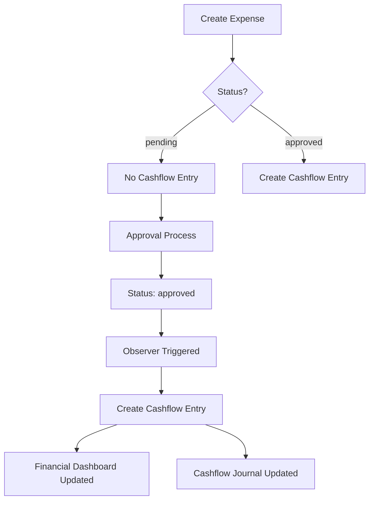

# Expense to Cashflow Integration Fix

## Overview

This document outlines the comprehensive solution to fix the financial integration issue where expenses weren't appearing in the financial dashboard and cashflow journal.

## Root Causes Identified

1. **Expense Status Flow Issue**: Expenses were created with `'pending'` status, but the observer only triggered on `'approved'` status
2. **Missing Database Categories**: The `EXP_PROJECT` cashflow category might not be seeded in the database
3. **Approval Workflow**: Status changes in approval controllers didn't properly trigger model observers
4. **Silent Failures**: Observer failed silently when categories were missing
5. **Authentication Context**: Observer used `auth()->id()` which could be null during certain operations

## Solution Components

### 1. Enhanced ProjectExpenseObserver (`app/Observers/ProjectExpenseObserver.php`)

**Key Improvements:**
- ✅ Added comprehensive logging for debugging
- ✅ Enhanced error handling with try-catch blocks and database transactions
- ✅ Auto-creation of missing `EXP_PROJECT` category
- ✅ Support for updating existing cashflow entries when expense details change
- ✅ Improved authentication context handling with fallbacks
- ✅ Better payment method determination and note generation

**New Features:**
- `updateCashflowEntry()` - Updates existing cashflow entries when expense details change
- `getOrCreateExpenseCategory()` - Ensures the required category exists
- `generateCashflowNotes()` - Creates comprehensive notes with all expense details
- Enhanced logging for all operations

### 2. Fixed Approval Controllers

**ExpenseApprovalController (`app/Http/Controllers/ExpenseApprovalController.php`):**
- ✅ Added comprehensive logging for approval workflow
- ✅ Ensured proper model event triggering when status changes to 'approved'

**ExpenseController (`app/Http/Controllers/ExpenseController.php`):**
- ✅ Added logging for approval workflow consistency
- ✅ Ensured observer triggers properly on status changes

### 3. Sync Command (`app/Console/Commands/SyncExpensesToCashflow.php`)

**Purpose:** Sync existing approved expenses that weren't integrated into the cashflow system.

**Features:**
- ✅ Dry-run mode to preview changes
- ✅ Force update existing entries
- ✅ Date range filtering
- ✅ Progress bar and detailed statistics
- ✅ Comprehensive error handling and logging

**Usage:**
```bash
# Dry run to see what would be synced
php artisan cashflow:sync-expenses --dry-run

# Sync all approved expenses
php artisan cashflow:sync-expenses

# Sync expenses from a specific date range
php artisan cashflow:sync-expenses --from-date=2024-01-01 --to-date=2024-12-31

# Force update existing entries
php artisan cashflow:sync-expenses --force
```

### 4. Integration Test Command (`app/Console/Commands/TestExpenseIntegration.php`)

**Purpose:** Comprehensive testing of the expense to cashflow integration.

**Test Cases:**
1. ✅ Check if cashflow categories exist
2. ✅ Create expense with pending status (should not create cashflow entry)
3. ✅ Update expense to approved status (should create cashflow entry)
4. ✅ Create expense directly with approved status (should create cashflow entry)
5. ✅ Update approved expense details (should update cashflow entry)
6. ✅ Change approved expense back to pending (should cancel cashflow entry)
7. ✅ Delete approved expense (should cancel cashflow entry)
8. ✅ Check financial dashboard integration
9. ✅ Check cashflow journal integration

**Usage:**
```bash
# Run all integration tests
php artisan test:expense-integration

# Run tests and cleanup test data
php artisan test:expense-integration --cleanup
```

### 5. Enhanced CashflowCategory Model (`app/Models/CashflowCategory.php`)

**Improvement:**
- ✅ Added `is_active` check to `getSystemCategory()` method for better reliability

## Installation & Setup Instructions

### Step 1: Ensure Database Categories are Seeded

```bash
# Run the cashflow category seeder
php artisan db:seed --class=CashflowCategorySeeder
```

### Step 2: Sync Existing Approved Expenses

```bash
# First, do a dry run to see what will be synced
php artisan cashflow:sync-expenses --dry-run

# If the dry run looks good, run the actual sync
php artisan cashflow:sync-expenses
```

### Step 3: Test the Integration

```bash
# Run comprehensive integration tests
php artisan test:expense-integration --cleanup
```

### Step 4: Monitor the Integration

Check the Laravel logs for integration activity:
```bash
tail -f storage/logs/laravel.log | grep -E "(ProjectExpense|Cashflow)"
```

## How the Integration Works

### Expense Creation Flow



### Observer Event Flow

1. **Expense Created**: Observer checks if status is 'approved'
2. **Expense Updated**: Observer checks if status changed to 'approved'
3. **Status Change to Approved**: Creates cashflow entry with 'confirmed' status
4. **Status Change from Approved**: Cancels existing cashflow entry
5. **Expense Deleted**: Cancels associated cashflow entry
6. **Expense Details Updated**: Updates existing cashflow entry if still approved

### Financial Dashboard Integration

The financial dashboard (`FinanceDashboardController`) automatically includes expense data because it queries `CashflowEntry` records with type 'expense'. Once expenses are properly integrated into cashflow entries, they will appear in:

- ✅ Total expense calculations
- ✅ Monthly trends charts
- ✅ Category breakdowns
- ✅ Recent transactions list
- ✅ Project financial summaries

### Cashflow Journal Integration

The cashflow journal (`CashflowController`) displays all `CashflowEntry` records, including those created from approved expenses. Features include:

- ✅ Filtering by expense type
- ✅ Project-based filtering
- ✅ Date range filtering
- ✅ Status-based filtering
- ✅ Reference back to original expense

## Troubleshooting

### Issue: Expenses still not appearing in dashboard

**Solution:**
1. Check if categories are seeded: `php artisan db:seed --class=CashflowCategorySeeder`
2. Run sync command: `php artisan cashflow:sync-expenses`
3. Check logs: `tail -f storage/logs/laravel.log`

### Issue: Observer not triggering

**Solution:**
1. Verify observer is registered in `AppServiceProvider.php`
2. Check if expense status is actually changing to 'approved'
3. Run integration test: `php artisan test:expense-integration`

### Issue: Categories missing

**Solution:**
1. Run seeder: `php artisan db:seed --class=CashflowCategorySeeder`
2. Or let the observer auto-create: The enhanced observer will create missing categories automatically

### Issue: Authentication errors in observer

**Solution:**
The enhanced observer includes fallback authentication handling. Check logs for specific errors.

## Monitoring & Maintenance

### Regular Checks

1. **Weekly**: Run sync command to catch any missed integrations
   ```bash
   php artisan cashflow:sync-expenses --dry-run
   ```

2. **Monthly**: Run integration tests to ensure everything is working
   ```bash
   php artisan test:expense-integration --cleanup
   ```

3. **Monitor Logs**: Set up log monitoring for integration errors
   ```bash
   grep -E "(ProjectExpense|Cashflow)" storage/logs/laravel.log
   ```

### Performance Considerations

- The observer uses database transactions for data consistency
- Bulk operations are available via the sync command
- Logging can be adjusted based on environment needs

## Summary

This comprehensive solution addresses all identified integration issues:

✅ **Fixed Observer Logic**: Enhanced to handle all expense status transitions
✅ **Added Error Handling**: Comprehensive error handling and logging
✅ **Auto-Category Creation**: Automatically creates missing categories
✅ **Sync Command**: Handles existing data integration
✅ **Test Suite**: Comprehensive testing of all integration points
✅ **Documentation**: Complete setup and troubleshooting guide

The integration now properly connects:
- Expense creation → Cashflow entries
- Cashflow entries → Financial dashboard
- Cashflow entries → Cashflow journal
- All with proper error handling and logging