# 📋 Telegram Bot Integration Plan untuk Laravel

## 🎯 Objective
Mengintegrasikan Telegram Bot dengan aplikasi Laravel untuk manajemen file proyek dengan fitur search, upload, dan organize otomatis.

## 📊 Architecture Overview


## 1️⃣ Menu Structure Design

### Navbar Addition
```
Manajemen
├── Dashboard
├── Proyek
├── Karyawan
├── Keuangan
├── Tools (NEW) ⭐
│   ├── Bot Configuration
│   ├── File Explorer
│   └── Bot Activity
└── Settings
```

### Tools Sidebar Layout
```
┌─────────────────────────────────────────────┐
│ Tools                                       │
├─────────────────────────────────────────────┤
│ 📱 Bot Configuration                        │
│    • Connection Settings                    │
│    • Token Management                       │
│    • Path Configuration                     │
│                                             │
│ 📁 File Explorer                           │
│    • Enhanced View                          │
│    • Bot Upload Monitor                     │
│    • Quick Navigation                       │
│                                             │
│ 📊 Bot Activity                            │
│    • Recent Uploads                         │
│    • User Sessions                          │
│    • Error Logs                            │
└─────────────────────────────────────────────┘
```

## 2️⃣ Database Schema

### Table: `bot_configurations`
```sql
CREATE TABLE bot_configurations (
    id BIGINT PRIMARY KEY AUTO_INCREMENT,
    bot_name VARCHAR(255) NOT NULL,
    bot_token VARCHAR(255) NOT NULL,
    bot_username VARCHAR(100),
    server_host VARCHAR(100) DEFAULT 'localhost',
    server_port INT DEFAULT 8081,
    use_local_server BOOLEAN DEFAULT true,
    webhook_url VARCHAR(255),
    default_storage_path VARCHAR(255) DEFAULT 'storage/app/proyek',
    max_file_size_mb INT DEFAULT 2000,
    allowed_users JSON, -- ["telegram_user_id1", "telegram_user_id2"]
    is_active BOOLEAN DEFAULT true,
    created_at TIMESTAMP,
    updated_at TIMESTAMP
);
```

### Table: `bot_activities`
```sql
CREATE TABLE bot_activities (
    id BIGINT PRIMARY KEY AUTO_INCREMENT,
    telegram_user_id VARCHAR(50),
    telegram_username VARCHAR(100),
    chat_id VARCHAR(50),
    message_type ENUM('command', 'file', 'text'),
    message_content TEXT,
    file_name VARCHAR(255),
    file_size BIGINT,
    file_path VARCHAR(500),
    project_id VARCHAR(100),
    status ENUM('success', 'failed', 'pending'),
    error_message TEXT,
    created_at TIMESTAMP
);
```

### Table: `bot_user_sessions`
```sql
CREATE TABLE bot_user_sessions (
    id BIGINT PRIMARY KEY AUTO_INCREMENT,
    telegram_user_id VARCHAR(50) UNIQUE,
    telegram_username VARCHAR(100),
    current_state VARCHAR(50), -- 'idle', 'searching', 'selecting_project', 'uploading'
    current_project_id VARCHAR(100),
    current_project_name VARCHAR(255),
    session_data JSON,
    last_activity TIMESTAMP,
    created_at TIMESTAMP,
    updated_at TIMESTAMP
);
```

## 3️⃣ Bot Command Flow

### Command Structure
```
/start - Memulai bot
/help - Bantuan penggunaan
/cari [nama_proyek] - Cari proyek
/pilih [project_id] - Pilih proyek untuk upload
/folder [nama_folder] - Buat folder baru di proyek aktif
/status - Lihat proyek yang sedang dipilih
/list - Lihat file di proyek aktif
/cancel - Batalkan operasi
```

### Interaction Flow

```mermaid
sequenceDiagram
    participant U as User
    participant B as Bot
    participant L as Laravel API
    participant S as Storage
    
    U->>B: /cari kampung malang
    B->>L: Search projects
    L-->>B: Return results
    B-->>U: Found 3 projects:<br/>1. kampung-malang-1 (ID: km-001)<br/>2. kampung-malang-2 (ID: km-002)
    
    U->>B: /pilih km-001
    B->>L: Set active project
    L-->>B: Project selected
    B-->>U: ✅ Project selected: kampung-malang-1
    
    U->>B: [Send Document/Photo]
    B->>L: Upload file
    L->>S: Save to project folder
    S-->>L: File saved
    L-->>B: Success
    B-->>U: ✅ File uploaded to kampung-malang-1/dokumen/
```


## 4️⃣ Laravel Components

### Routes Structure
```php
// routes/web.php
Route::prefix('tools')->middleware(['auth'])->group(function () {
    // Bot Configuration
    Route::get('/bot-config', [BotConfigController::class, 'index'])->name('tools.bot-config');
    Route::post('/bot-config', [BotConfigController::class, 'update']);
    Route::post('/bot-config/test', [BotConfigController::class, 'testConnection']);
    
    // Enhanced File Explorer
    Route::get('/file-explorer', [ToolsFileExplorerController::class, 'index'])->name('tools.file-explorer');
    Route::get('/file-explorer/browse', [ToolsFileExplorerController::class, 'browse']);
    
    // Bot Activity
    Route::get('/bot-activity', [BotActivityController::class, 'index'])->name('tools.bot-activity');
    Route::get('/bot-activity/logs', [BotActivityController::class, 'getLogs']);
});

// routes/api.php
Route::post('/telegram/webhook', [TelegramWebhookController::class, 'handle'])
    ->withoutMiddleware(['csrf']);
```

### Service Classes
```
app/Services/
├── TelegramBotService.php       # Core bot operations
├── ProjectSearchService.php     # Search projects
├── FileOrganizeService.php      # Organize uploaded files
└── BotCommandHandler.php        # Handle bot commands
```

## 5️⃣ UI Components

### Bot Configuration Page
```blade
<!-- resources/views/tools/bot-config.blade.php -->
<div class="container-fluid">
    <div class="row">
        <!-- Sidebar -->
        <div class="col-md-3">
            @include('tools.partials.sidebar')
        </div>
        
        <!-- Main Content -->
        <div class="col-md-9">
            <div class="card">
                <div class="card-header">
                    <h3>🤖 Bot Configuration</h3>
                </div>
                <div class="card-body">
                    <!-- Connection Status -->
                    <div class="alert alert-success">
                        ✅ Bot Connected: @proyek_ardani_bot
                    </div>
                    
                    <!-- Configuration Form -->
                    <form>
                        <div class="form-group">
                            <label>Bot Token</label>
                            <input type="password" class="form-control" value="••••••••">
                        </div>
                        
                        <div class="row">
                            <div class="col-md-6">
                                <label>Server Host</label>
                                <input type="text" class="form-control" value="localhost">
                            </div>
                            <div class="col-md-6">
                                <label>Server Port</label>
                                <input type="number" class="form-control" value="8081">
                            </div>
                        </div>
                        
                        <div class="form-group">
                            <label>Default Storage Path</label>
                            <input type="text" class="form-control" value="storage/app/proyek">
                        </div>
                        
                        <div class="form-group">
                            <label>Allowed Users (Telegram IDs)</label>
                            <textarea class="form-control" rows="3"></textarea>
                            <small>One ID per line. Leave empty to allow all.</small>
                        </div>
                        
                        <button type="submit" class="btn btn-primary">Save Configuration</button>
                        <button type="button" class="btn btn-info">Test Connection</button>
                    </form>
                </div>
            </div>
        </div>
    </div>
</div>
```

### Enhanced File Explorer
```blade
<!-- resources/views/tools/file-explorer.blade.php -->
<div class="container-fluid">
    <div class="row">
        <!-- Sidebar -->
        <div class="col-md-2">
            @include('tools.partials.sidebar')
        </div>
        
        <!-- File Explorer - Full Width -->
        <div class="col-md-10">
            <div class="card h-100">
                <div class="card-header d-flex justify-content-between">
                    <h3>📁 File Explorer - Bot Integration Monitor</h3>
                    <div>
                        <span class="badge badge-success">
                            <i class="fas fa-circle"></i> Bot Active
                        </span>
                        <span class="badge badge-info">
                            Last Upload: 2 minutes ago
                        </span>
                    </div>
                </div>
                <div class="card-body p-0">
                    <!-- Vue Component for File Explorer -->
                    <vue-file-explorer-enhanced
                        :show-bot-uploads="true"
                        :highlight-recent="true"
                        :full-screen="true">
                    </vue-file-explorer-enhanced>
                </div>
            </div>
        </div>
    </div>
</div>
```

## 6️⃣ Security Considerations

### Authentication & Authorization
- ✅ Telegram User ID validation
- ✅ Allowed users whitelist
- ✅ Project access permissions
- ✅ File type restrictions
- ✅ Rate limiting per user

### File Security
- ✅ Virus scanning for uploaded files
- ✅ File size validation (max 2GB)
- ✅ Allowed file extensions
- ✅ Sanitize file names
- ✅ Prevent directory traversal

## 7️⃣ Implementation Phases

### Phase 1: Foundation (Week 1)
- [ ] Create Tools menu structure
- [ ] Setup database tables
- [ ] Basic bot configuration UI
- [ ] Webhook endpoint setup

### Phase 2: Core Features (Week 2)
- [ ] Bot command handlers
- [ ] Project search functionality
- [ ] File upload handling
- [ ] Session management

### Phase 3: UI Enhancement (Week 3)
- [ ] Enhanced file explorer
- [ ] Bot activity dashboard
- [ ] Real-time notifications
- [ ] Error handling & logging

### Phase 4: Advanced Features (Week 4)
- [ ] Batch file operations
- [ ] Auto-categorization
- [ ] User permissions
- [ ] Analytics & reporting

## 8️⃣ Bot Commands Implementation

### Search Command Handler
```php
class SearchCommandHandler {
    public function handle($searchTerm) {
        $projects = Project::where('name', 'LIKE', "%{$searchTerm}%")
            ->orWhere('code', 'LIKE', "%{$searchTerm}%")
            ->limit(10)
            ->get();
        
        if ($projects->isEmpty()) {
            return "❌ Tidak ada proyek ditemukan untuk: {$searchTerm}";
        }
        
        $message = "📋 Hasil pencarian:\n\n";
        foreach ($projects as $index => $project) {
            $message .= ($index + 1) . ". {$project->name}\n";
            $message .= "   ID: {$project->code}\n";
            $message .= "   /pilih {$project->code}\n\n";
        }
        
        return $message;
    }
}
```

### File Upload Handler
```php
class FileUploadHandler {
    public function handle($fileId, $fileName, $projectId) {
        // Download from Telegram
        $filePath = $this->telegramService->downloadFile($fileId);
        
        // Determine folder based on file type
        $folder = $this->determineFolder($fileName);
        
        // Move to project folder
        $destination = "proyek/{$projectId}/{$folder}/{$fileName}";
        Storage::move($filePath, $destination);
        
        // Log activity
        BotActivity::create([
            'file_name' => $fileName,
            'file_path' => $destination,
            'project_id' => $projectId,
            'status' => 'success'
        ]);
        
        return "✅ File uploaded to: {$projectId}/{$folder}/";
    }
}
```

## 9️⃣ Testing Strategy

### Unit Tests
- Bot command parsing
- File upload validation
- Project search logic
- Permission checks

### Integration Tests
- Webhook handling
- File storage operations
- Database transactions
- API endpoints

### E2E Tests
- Complete bot interaction flow
- UI navigation
- File upload via bot
- Activity monitoring

## 🎯 Success Metrics

- ✅ Bot response time < 2 seconds
- ✅ File upload success rate > 95%
- ✅ Support files up to 2GB
- ✅ Handle 100+ concurrent users
- ✅ Zero data loss
- ✅ 99.9% uptime

## 📝 Notes

- Local server already configured and running
- Bot token: @proyek_ardani_bot
- Server: localhost:8081
- Max file size: 2GB (vs 20MB official)
- Storage path: storage/app/proyek/

---

**Next Step:** Review this plan and proceed with Phase 1 implementation