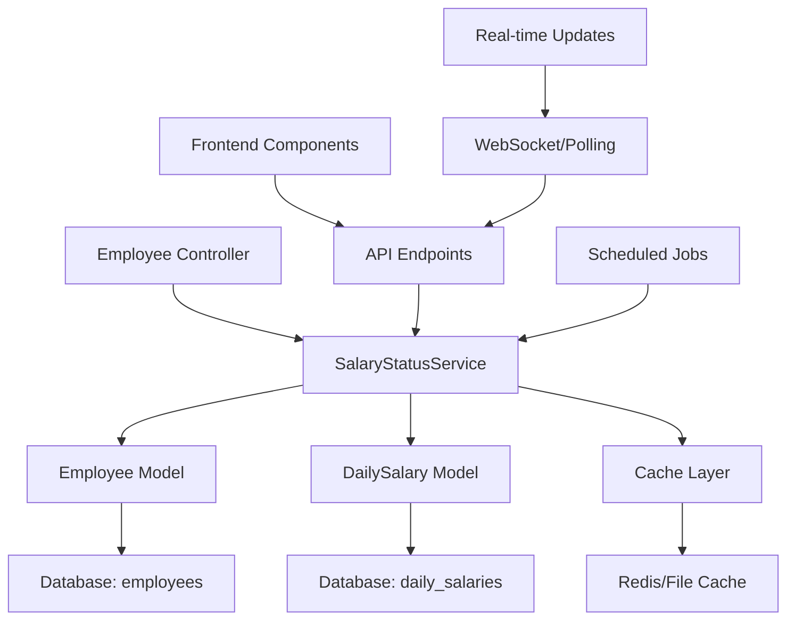

# Wireframe Integrasi: Fitur Status Gaji Karyawan

## 🏗️ Arsitektur Sistem

### 1. Backend Architecture



### 2. Database Schema Enhancement

```sql
-- Tidak perlu tabel baru, menggunakan data existing:
-- employees table (sudah ada)
-- daily_salaries table (sudah ada)

-- Optional: Cache table untuk performance
CREATE TABLE salary_status_cache (
    id BIGINT PRIMARY KEY AUTO_INCREMENT,
    employee_id BIGINT NOT NULL,
    month TINYINT NOT NULL,
    year SMALLINT NOT NULL,
    total_work_days INT DEFAULT 0,
    input_days INT DEFAULT 0,
    completion_percentage DECIMAL(5,2) DEFAULT 0,
    status ENUM('complete', 'partial', 'empty') DEFAULT 'empty',
    last_input_date DATE NULL,
    updated_at TIMESTAMP DEFAULT CURRENT_TIMESTAMP ON UPDATE CURRENT_TIMESTAMP,
    
    UNIQUE KEY unique_employee_month (employee_id, month, year),
    FOREIGN KEY (employee_id) REFERENCES employees(id) ON DELETE CASCADE,
    INDEX idx_month_year (month, year),
    INDEX idx_status (status)
);
```

---

## 🔧 Backend Implementation Plan

### 1. Service Layer: SalaryStatusService

```php
<?php
// app/Services/SalaryStatusService.php

class SalaryStatusService
{
    public function getEmployeeSalaryStatus($employeeId, $month = null, $year = null)
    {
        // Logic untuk menghitung status gaji karyawan
        // Return: ['status' => 'complete|partial|empty', 'percentage' => 85, 'days' => '12/15']
    }
    
    public function getAllEmployeesSalaryStatus($month = null, $year = null)
    {
        // Logic untuk mendapatkan status semua karyawan
        // Return: Collection of employee status
    }
    
    public function getSalaryStatusSummary($month = null, $year = null)
    {
        // Logic untuk ringkasan keseluruhan
        // Return: ['total' => 15, 'complete' => 5, 'partial' => 7, 'empty' => 3]
    }
    
    public function getWorkingDaysInMonth($month, $year)
    {
        // Logic untuk menghitung hari kerja dalam bulan (exclude weekend)
    }
    
    public function refreshStatusCache($employeeId = null)
    {
        // Logic untuk refresh cache status
    }
}
```

### 2. Controller Enhancement

```php
<?php
// app/Http/Controllers/EmployeeController.php

class EmployeeController extends Controller
{
    protected $salaryStatusService;
    
    public function __construct(SalaryStatusService $salaryStatusService)
    {
        $this->salaryStatusService = $salaryStatusService;
    }
    
    public function index(Request $request)
    {
        // Existing code...
        
        // Add salary status data
        $salaryStatuses = $this->salaryStatusService->getAllEmployeesSalaryStatus();
        
        return view('employees.index', compact(
            'employees', 
            'departments', 
            'employmentTypes', 
            'stats',
            'salaryStatuses' // New data
        ));
    }
    
    // New API endpoints
    public function getSalaryStatusSummary(Request $request)
    {
        $month = $request->get('month', now()->month);
        $year = $request->get('year', now()->year);
        
        $summary = $this->salaryStatusService->getSalaryStatusSummary($month, $year);
        
        return response()->json($summary);
    }
    
    public function getSalaryStatusDetail(Request $request)
    {
        $month = $request->get('month', now()->month);
        $year = $request->get('year', now()->year);
        
        $employees = $this->salaryStatusService->getAllEmployeesSalaryStatus($month, $year);
        
        return response()->json($employees);
    }
}
```

### 3. Model Enhancement

```php
<?php
// app/Models/Employee.php

class Employee extends Model
{
    // Existing code...
    
    // New methods for salary status
    public function getSalaryStatusForMonth($month = null, $year = null)
    {
        $month = $month ?? now()->month;
        $year = $year ?? now()->year;
        
        $workingDays = $this->getWorkingDaysInMonth($month, $year);
        $inputDays = $this->dailySalaries()
            ->whereMonth('work_date', $month)
            ->whereYear('work_date', $year)
            ->where('status', 'confirmed')
            ->count();
            
        $percentage = $workingDays > 0 ? ($inputDays / $workingDays) * 100 : 0;
        
        return [
            'working_days' => $workingDays,
            'input_days' => $inputDays,
            'percentage' => round($percentage, 1),
            'status' => $this->determineSalaryStatus($percentage),
            'last_input_date' => $this->getLastSalaryInputDate($month, $year)
        ];
    }
    
    private function determineSalaryStatus($percentage)
    {
        if ($percentage >= 90) return 'complete';
        if ($percentage >= 50) return 'partial';
        return 'empty';
    }
    
    private function getLastSalaryInputDate($month, $year)
    {
        return $this->dailySalaries()
            ->whereMonth('work_date', $month)
            ->whereYear('work_date', $year)
            ->where('status', 'confirmed')
            ->latest('work_date')
            ->value('work_date');
    }
    
    private function getWorkingDaysInMonth($month, $year)
    {
        // Logic to calculate working days (exclude weekends)
        $startDate = Carbon::create($year, $month, 1);
        $endDate = $startDate->copy()->endOfMonth();
        
        $workingDays = 0;
        for ($date = $startDate->copy(); $date <= $endDate; $date->addDay()) {
            if (!$date->isWeekend()) {
                $workingDays++;
            }
        }
        
        return $workingDays;
    }
}
```

---

## 🎨 Frontend Implementation Plan

### 1. Blade Template Enhancement

```php
<!-- resources/views/employees/index.blade.php -->

<!-- Add new header button -->
<div class="flex space-x-2">
    <button id="salary-status-btn" 
            class="bg-purple-500 hover:bg-purple-700 text-white font-bold py-2 px-4 rounded">
        <i class="fas fa-chart-pie mr-2"></i>Status Gaji
    </button>
    <!-- Existing buttons... -->
</div>

<!-- Modify employee table to include status column -->
<table class="min-w-full divide-y divide-gray-200">
    <thead class="bg-gray-50">
        <tr>
            <!-- Existing columns... -->
            <th class="px-6 py-3 text-left text-xs font-medium text-gray-500 uppercase tracking-wider">
                Status Gaji
            </th>
            <!-- Existing columns... -->
        </tr>
    </thead>
    <tbody class="bg-white divide-y divide-gray-200">
        @foreach($employees as $employee)
            <tr class="hover:bg-gray-50">
                <!-- Existing columns... -->
                <td class="px-6 py-4 whitespace-nowrap">
                    @php
                        $salaryStatus = $salaryStatuses[$employee->id] ?? null;
                    @endphp
                    
                    @if($salaryStatus)
                        @include('components.salary-status-indicator', ['status' => $salaryStatus])
                    @else
                        <span class="text-gray-400">-</span>
                    @endif
                </td>
                <!-- Existing columns... -->
            </tr>
        @endforeach
    </tbody>
</table>

<!-- Salary Status Modal -->
<div id="salary-status-modal" class="hidden fixed inset-0 bg-gray-600 bg-opacity-50 overflow-y-auto h-full w-full z-50">
    <div class="relative top-20 mx-auto p-5 border w-11/12 md:w-3/4 lg:w-1/2 shadow-lg rounded-md bg-white">
        <!-- Modal content will be loaded here -->
    </div>
</div>
```

### 2. Component: Salary Status Indicator

```php
<!-- resources/views/components/salary-status-indicator.blade.php -->

@php
    $statusConfig = [
        'complete' => [
            'color' => 'green',
            'icon' => 'fas fa-check-circle',
            'text' => 'Lengkap'
        ],
        'partial' => [
            'color' => 'yellow',
            'icon' => 'fas fa-exclamation-triangle',
            'text' => 'Kurang'
        ],
        'empty' => [
            'color' => 'red',
            'icon' => 'fas fa-times-circle',
            'text' => 'Belum'
        ]
    ];
    
    $config = $statusConfig[$status['status']] ?? $statusConfig['empty'];
@endphp

<div class="flex items-center space-x-2">
    <div class="flex items-center">
        <i class="{{ $config['icon'] }} text-{{ $config['color'] }}-500"></i>
        <span class="ml-1 text-sm font-medium text-{{ $config['color'] }}-700">
            {{ $status['input_days'] }}/{{ $status['working_days'] }}
        </span>
    </div>
    <span class="inline-flex items-center px-2.5 py-0.5 rounded-full text-xs font-medium bg-{{ $config['color'] }}-100 text-{{ $config['color'] }}-800">
        {{ $config['text'] }}
    </span>
</div>

@if($status['percentage'] > 0)
    <div class="w-full bg-gray-200 rounded-full h-2 mt-1">
        <div class="bg-{{ $config['color'] }}-500 h-2 rounded-full" 
             style="width: {{ $status['percentage'] }}%"></div>
    </div>
@endif
```

### 3. JavaScript Implementation

```javascript
// resources/js/salary-status.js

class SalaryStatusManager {
    constructor() {
        this.modal = document.getElementById('salary-status-modal');
        this.init();
    }
    
    init() {
        // Bind events
        document.getElementById('salary-status-btn').addEventListener('click', () => {
            this.showModal();
        });
        
        // Auto refresh every 5 minutes
        setInterval(() => {
            this.refreshStatusIndicators();
        }, 300000);
    }
    
    async showModal() {
        try {
            const response = await fetch('/api/employees/salary-status-summary');
            const data = await response.json();
            
            this.renderModal(data);
            this.modal.classList.remove('hidden');
        } catch (error) {
            console.error('Error loading salary status:', error);
        }
    }
    
    renderModal(data) {
        const modalContent = `
            <div class="flex justify-between items-center mb-4">
                <h3 class="text-lg font-medium text-gray-900">
                    📊 Status Input Gaji - ${this.getCurrentMonthName()}
                </h3>
                <button onclick="this.closest('.fixed').classList.add('hidden')" 
                        class="text-gray-400 hover:text-gray-600">
                    <i class="fas fa-times"></i>
                </button>
            </div>
            
            <div class="mb-6">
                <div class="grid grid-cols-2 md:grid-cols-4 gap-4">
                    <div class="text-center">
                        <div class="text-2xl font-bold text-gray-900">${data.total}</div>
                        <div class="text-sm text-gray-500">Total Karyawan</div>
                    </div>
                    <div class="text-center">
                        <div class="text-2xl font-bold text-green-600">${data.complete}</div>
                        <div class="text-sm text-gray-500">Lengkap</div>
                    </div>
                    <div class="text-center">
                        <div class="text-2xl font-bold text-yellow-600">${data.partial}</div>
                        <div class="text-sm text-gray-500">Kurang</div>
                    </div>
                    <div class="text-center">
                        <div class="text-2xl font-bold text-red-600">${data.empty}</div>
                        <div class="text-sm text-gray-500">Belum Input</div>
                    </div>
                </div>
            </div>
            
            ${this.renderEmployeeList(data.employees)}
            
            <div class="flex justify-end space-x-3 mt-6">
                <button onclick="window.location.href='/finance/daily-salaries/create'" 
                        class="bg-blue-500 hover:bg-blue-700 text-white font-bold py-2 px-4 rounded">
                    📝 Input Gaji
                </button>
                <button onclick="this.closest('.fixed').classList.add('hidden')" 
                        class="bg-gray-300 hover:bg-gray-400 text-gray-800 font-bold py-2 px-4 rounded">
                    Tutup
                </button>
            </div>
        `;
        
        this.modal.querySelector('.relative').innerHTML = modalContent;
    }
    
    renderEmployeeList(employees) {
        const priorityEmployees = employees.filter(emp => emp.status === 'empty');
        const partialEmployees = employees.filter(emp => emp.status === 'partial');
        
        let html = '';
        
        if (priorityEmployees.length > 0) {
            html += `
                <div class="mb-4">
                    <h4 class="text-md font-medium text-red-700 mb-2">🔴 Prioritas Tinggi (Belum Input):</h4>
                    <div class="space-y-2">
                        ${priorityEmployees.map(emp => `
                            <div class="flex justify-between items-center p-2 bg-red-50 rounded">
                                <span class="text-sm">${emp.name} (${emp.employee_code})</span>
                                <button onclick="window.location.href='/finance/daily-salaries/create?employee_id=${emp.id}'" 
                                        class="text-xs bg-red-500 text-white px-2 py-1 rounded hover:bg-red-600">
                                    📝 Input Sekarang
                                </button>
                            </div>
                        `).join('')}
                    </div>
                </div>
            `;
        }
        
        if (partialEmployees.length > 0) {
            html += `
                <div class="mb-4">
                    <h4 class="text-md font-medium text-yellow-700 mb-2">🟡 Perlu Dilengkapi:</h4>
                    <div class="space-y-2">
                        ${partialEmployees.map(emp => `
                            <div class="flex justify-between items-center p-2 bg-yellow-50 rounded">
                                <span class="text-sm">${emp.name} (${emp.input_days}/${emp.working_days} hari)</span>
                                <button onclick="window.location.href='/finance/employees/${emp.id}'" 
                                        class="text-xs bg-yellow-500 text-white px-2 py-1 rounded hover:bg-yellow-600">
                                    📝 Lengkapi
                                </button>
                            </div>
                        `).join('')}
                    </div>
                </div>
            `;
        }
        
        return html;
    }
    
    async refreshStatusIndicators() {
        // Logic to refresh status indicators without full page reload
        try {
            const response = await fetch('/api/employees/salary-status-detail');
            const data = await response.json();
            
            // Update indicators in the table
            data.forEach(employee => {
                const indicator = document.querySelector(`[data-employee-id="${employee.id}"] .salary-status-indicator`);
                if (indicator) {
                    indicator.innerHTML = this.renderStatusIndicator(employee);
                }
            });
        } catch (error) {
            console.error('Error refreshing status indicators:', error);
        }
    }
    
    getCurrentMonthName() {
        const months = [
            'Januari', 'Februari', 'Maret', 'April', 'Mei', 'Juni',
            'Juli', 'Agustus', 'September', 'Oktober', 'November', 'Desember'
        ];
        return months[new Date().getMonth()] + ' ' + new Date().getFullYear();
    }
}

// Initialize when DOM is loaded
document.addEventListener('DOMContentLoaded', () => {
    new SalaryStatusManager();
});
```

---

## 🚀 API Routes

```php
// routes/web.php or routes/api.php

Route::prefix('api/employees')->group(function () {
    Route::get('/salary-status-summary', [EmployeeController::class, 'getSalaryStatusSummary']);
    Route::get('/salary-status-detail', [EmployeeController::class, 'getSalaryStatusDetail']);
    Route::post('/refresh-salary-status-cache', [EmployeeController::class, 'refreshSalaryStatusCache']);
});
```

---

## ⚡ Performance Optimization

### 1. Caching Strategy
- Cache salary status per employee per month
- Invalidate cache when new salary input is added
- Use Redis for better performance

### 2. Database Optimization
- Add indexes on frequently queried columns
- Use eager loading to prevent N+1 queries
- Consider database views for complex calculations

### 3. Frontend Optimization
- Lazy load modal content
- Use debouncing for real-time updates
- Implement virtual scrolling for large employee lists

---

## 🔄 Event Handling

### 1. Real-time Updates
```php
// When salary is created/updated/deleted
event(new SalaryStatusChanged($employee->id, $month, $year));

// Listener to refresh cache
class RefreshSalaryStatusCache
{
    public function handle(SalaryStatusChanged $event)
    {
        app(SalaryStatusService::class)->refreshStatusCache($event->employeeId);
    }
}
```

### 2. Scheduled Jobs
```php
// app/Console/Commands/RefreshSalaryStatusCache.php
// Run daily to ensure cache is up to date

class RefreshSalaryStatusCache extends Command
{
    protected $signature = 'salary:refresh-status-cache';
    
    public function handle()
    {
        app(SalaryStatusService::class)->refreshStatusCache();
    }
}
```

---

## 📱 Mobile Responsiveness

### Responsive Design Considerations:
1. **Mobile**: Stack layout, collapsible sections
2. **Tablet**: Grid layout with 2 columns
3. **Desktop**: Full table layout with all columns

### Touch-friendly Elements:
- Larger buttons (min 44px)
- Swipe gestures for modal navigation
- Pull-to-refresh functionality